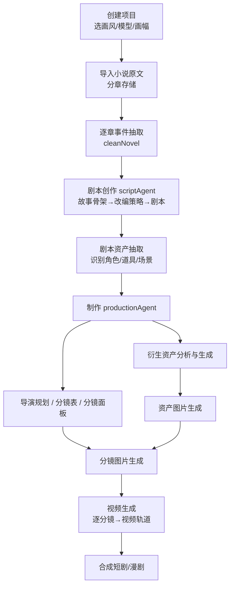
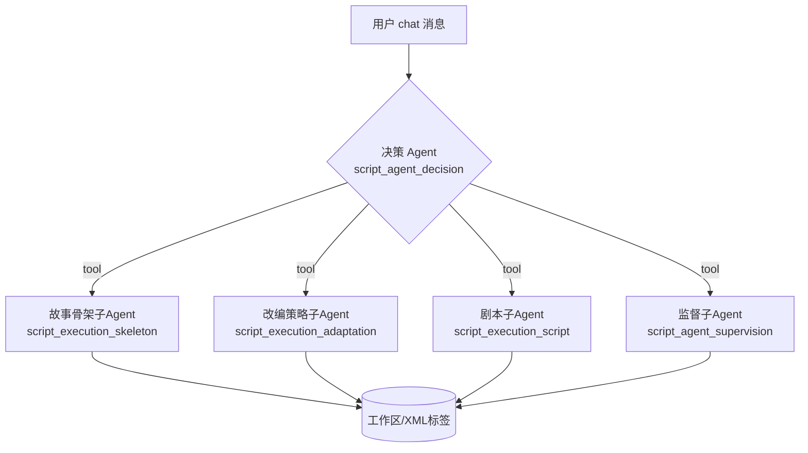
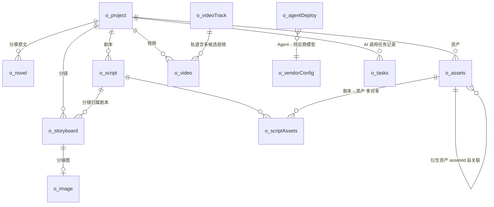
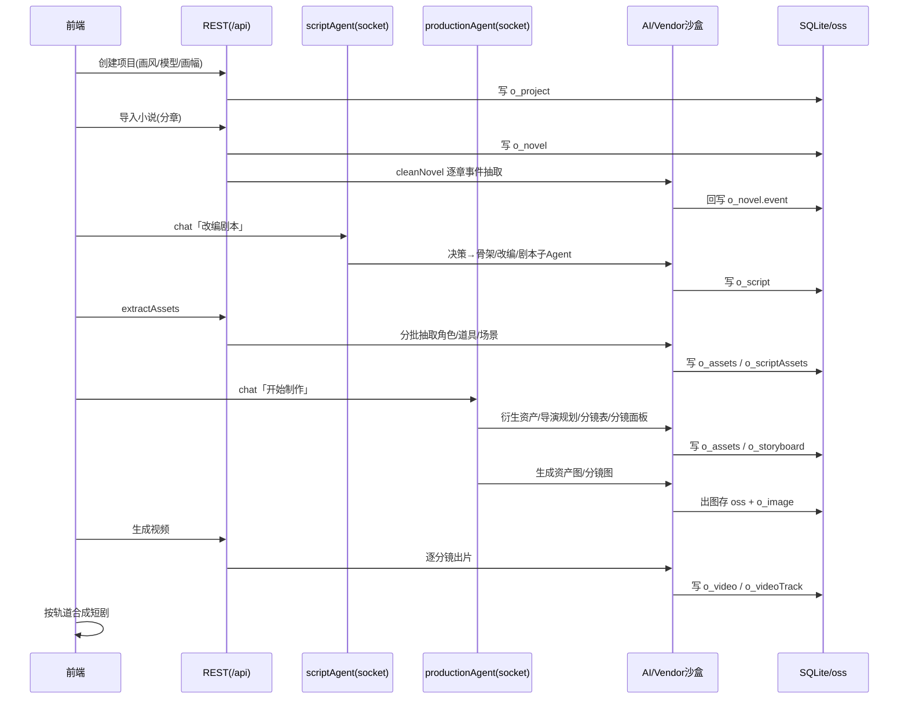

# Toonflow 业务流程分析

> 本文档分析 Toonflow 后端（本仓库）的整体业务流程：从一部小说原文，到自动改编为剧本，再到 AI 生成分镜图片与视频的完整链路。
> 面向需要快速理解系统全貌的开发者，重点讲「数据怎么流动、各阶段谁在干活」，而非逐行代码细节。

## 1. 一句话概述

Toonflow 把「**小说 → 剧本 → 视觉资产 → 分镜 → 视频**」这条创作流水线，拆成若干阶段，每个阶段由一组**多 Agent 协作的 AI 编排**驱动，所有产物落在本地 SQLite（`db2.sqlite`）与对象存储目录（`data/oss/`），最终合成短剧/漫剧。

## 2. 运行形态与技术骨架

| 维度 | 说明 |
| --- | --- |
| 形态 | 后端 Express 服务 + Electron 桌面壳（前端静态产物在 `data/web/`） |
| 环境判断 | `typeof process.versions.electron`：纯 Node（dev，数据目录 `<cwd>/data`）/ Electron（prod，数据目录 `userData/data`） |
| HTTP 入口 | `src/app.ts` → `startServe()`，监听 `10588` |
| 实时通道 | socket.io，两个命名空间 `/api/socket/scriptAgent`、`/api/socket/productionAgent` |
| 鉴权 | JWT，密钥取自 `o_setting.tokenKey`；除 `/api/login/login` 外全部接口（及 socket 握手）需 token |
| 路由 | 文件即路由（`src/routes/**` 由 `src/core.ts` 扫描生成 `src/router.ts`，挂在 `/api`） |
| 工具聚合 | `import u from "@/utils"`，`u.db / u.oss / u.Ai / u.vm / u.vendor / u.getPath / u.task` |
| 数据库 | knex + better-sqlite3，库文件 `db2.sqlite`，加载即 `initDB`（建表/种子）+ `fixDB`（迁移） |
| AI 调用 | Vercel AI SDK（`ai` 包 + `@ai-sdk/*`），模型供应商以 TS 代码存储、vm2 沙盒热执行 |

两类接口分工：

- **REST 接口（`/api/...`）**：CRUD、文件上传、触发批处理（如事件抽取、资产抽取、图片/视频生成）。
- **Socket 命名空间**：承载两个对话式 AI Agent（剧本 Agent、制作 Agent）的流式编排，前端通过 `chat` 事件发消息、订阅流式回推。

## 3. 端到端业务流程总览

各阶段产物与承载表：

| 阶段 | 触发方式 | 主要产物 | 落库表 |
| --- | --- | --- | --- |
| ① 项目准备 | REST | 项目配置（画风、图像/视频模型、画幅） | `o_project` |
| ② 小说导入 | REST `addNovel` | 分章原文 | `o_novel` |
| ③ 事件抽取 | REST（异步 `cleanNovel`） | 每章事件摘要 | `o_novel.event` / `o_event` |
| ④ 剧本创作 | Socket `scriptAgent` | 故事骨架、改编策略、剧本 | `o_script` |
| ⑤ 资产抽取 | REST `extractAssets` | 角色/道具/场景资产 | `o_assets`、`o_scriptAssets` |
| ⑥ 制作编排 | Socket `productionAgent` | 衍生资产、分镜表、分镜面板 | `o_assets`、`o_storyboard` |
| ⑦ 资产/分镜出图 | Socket 工具回调 + REST | 图片文件 | `o_oss` 文件 + `o_image` |
| ⑧ 视频生成 | REST/工具 | 分镜视频、视频轨道 | `o_video`、`o_videoTrack` |

## 4. 阶段详解

### 4.1 项目准备（`o_project`）

项目是一切的上下文容器。关键字段（见 `o_project`）：

- `name` / `type` / `intro`：小说名称、类型、简介。
- `artStyle`：目标改编画风（视觉手册），对应 `data/skills/art_skills/<画风>/` 下的技能集。
- `directorManual`：导演手册，对应 `data/skills/story_skills/<手册>/`。
- `imageModel` / `videoModel`：形如 `<vendorId>:<modelName>`，决定后续出图/出片用哪个供应商模型。
- `videoRatio`（画幅，默认 `16:9`）、`mode`（视频参考模式，决定是否「多参」）、`imageQuality`。

这些配置会在后续每个 Agent 启动时注入到系统提示（项目信息块 + 模型信息块），让 AI 知道「为谁、用什么模型、什么画风」创作。

### 4.2 小说导入与事件抽取

**导入**（`src/routes/novel/addNovel.ts`）：前端按「卷(reel)/章(chapter)/正文(chapterData)」结构批量提交，后端按 `chapterIndex` 递增逐章写入 `o_novel`，初始 `eventState=0`（未抽取）。

**事件抽取**：导入后立即异步启动 `u.cleanNovel`（`src/utils/cleanNovel.ts`），逐章用 AI 提炼「事件摘要」，通过事件发射器 `emitter.on("item")` 回写每章的 `event` 字段与 `eventState`（`1` 成功 / `-1` 失败）。事件是后续剧本改编的压缩输入——剧本 Agent 不需要读全文，读事件骨架即可，节省上下文。

> 事件相关还有 `o_event` / `o_eventChapter` 表与 `routes/novel/event/*`（生成、查询、删除事件），支持对抽取结果的二次编辑。

### 4.3 剧本创作 —— scriptAgent（Socket 编排）

这是第一个多 Agent 协作系统，命名空间 `/api/socket/scriptAgent`，入口 `src/socket/routes/scriptAgent.ts` → `src/agents/scriptAgent/index.ts`。

**握手**：socket 连接需带 `token`、`isolationKey`（会话隔离键，用于记忆分区）、`projectId`。

**结构：决策层 Agent + 执行子 Agent + 监督层 Agent**

工作机制（`runDecisionAI`）：

1. **决策 Agent** 加载 `data/skills/script_agent_decision.md` 作为系统提示，注入：项目信息 + 记忆（RAG/摘要/近期对话）+ 用户消息。
2. 决策 Agent 通过 **tool 调用**驱动各执行子 Agent（`run_sub_agent_storySkeleton` / `_adaptationStrategy` / `_script`）和监督 Agent（`run_supervision_agent`）。
3. 每个子 Agent 各自加载对应 skill 文件作系统提示，产出时**被强制要求用约定 XML 标签写入工作区**，例如：
   - 故事骨架：`<storySkeleton>...</storySkeleton>`
   - 改编策略：`<adaptationStrategy>...</adaptationStrategy>`
   - 剧本：`<scriptItem name="剧本名">...</scriptItem>`（可多条）
4. 子 Agent 的完整输出经 `removeAllXmlTags` 去标签后写入**记忆系统**（按 `assistant:execution:*` 等 memoryKey 分类）。
5. 全程 `consumeFullStream` 解析流式 chunk（reasoning 思考块 / text 正文 / error），通过 `ResTool` 实时回推前端（支持「思考中…」「思考完毕 N 秒」等 UI 态）。

剧本子 Agent 还会注入「可用剧本列表(ID:名称)」与章节数量，便于增量改写。最终剧本落 `o_script`（`content`、`name`、`extractState`）。

> 每个子 Agent 的模型由 AI key（如 `scriptAgent:scriptAgent`）经 `o_agentDeploy` 映射，详见 §5.1。

### 4.4 剧本资产抽取（`extractAssets`）

`src/routes/script/extractAssets.ts`：对一批剧本（`scriptIds`）做 AI 抽取，识别其中的**角色(role)/道具(tool)/场景(scene)**资产。

- 剧本按 5 个一组分批（`chunkArray`）调用 AI，降低单次上下文压力。
- 区分**新资产**（首次识别，需完整 name/desc/type/scriptIds）与**已有资产引用**（仅 name + scriptIds，名称须与库内完全一致），避免重复创建。
- 结果写入 `o_assets`，并通过 `o_scriptAssets` 建立「剧本↔资产」多对多关联，`o_script.extractState` 标记抽取状态。

资产是连接「剧本」与「视觉制作」的枢纽：剧本里出现的人/物/景，先抽成资产，再在制作阶段为每个资产生成参考图，保证全片视觉一致性。

### 4.5 制作编排 —— productionAgent（Socket 编排）

第二个多 Agent 系统，命名空间 `/api/socket/productionAgent`，结构与 scriptAgent 对称但子 Agent 更多，入口 `src/agents/productionAgent/index.ts`。

**决策 Agent** 加载 `production_agent_decision.md`，注入项目信息 + **模型信息**（图像模型、视频模型、是否多参）+ 记忆，再通过 tool 调度下列执行子 Agent：

| 子 Agent（tool） | skill 文件 | 职责 | 工作区 XML |
| --- | --- | --- | --- |
| `run_sub_agent_derive_assets` | `production_execution_derive_assets.md` | 衍生资产分析与信息写入 | 调 `add_deriveAsset` 工具 |
| `run_sub_agent_generate_assets` | `production_execution_generate_assets.md` | 衍生资产图片生成 | 调 `generate_deriveAsset` |
| `run_sub_agent_director_plan` | `production_execution_director_plan.md` | 导演/拍摄规划 | `<scriptPlan>...</scriptPlan>` |
| `run_sub_agent_storyboard_table` | `production_execution_storyboard_table.md` | 分镜表构建 | `<storyboardTable>...</storyboardTable>` |
| `run_sub_agent_storyboard_panel` | `production_execution_storyboard_panel.md` | 分镜面板写入 | `<storyboardItem .../>` |
| `run_sub_agent_storyboard_gen` | `production_execution_storyboard_gen.md` | 分镜图生成 | 调 `generate_storyboard` |
| `run_sub_agent_supervision` | `production_agent_supervision.md` | 监督/质检 | — |

**画风技能动态加载**：制作子 Agent 启动时，依据项目的 `artStyle` 和 `directorManual`，从 `data/skills/art_skills/<画风>/driector_skills/` 与 `story_skills/<手册>/driector_skills/`（部分还含 `production_skills/`）扫描 `.md` 技能，构建 `activate_skill` 工具——子 Agent 按需「激活」专业技能加载完整指令。这让出图/出片的专业 know-how 完全外置在 skill 文件里，改提示词无需改代码。

**制作阶段的工具（`src/agents/productionAgent/tools.ts`）** 是真正改数据的地方：

- `get_flowData`：向前端请求工作区某段数据（剧本/拍摄计划/资产/分镜表/分镜面板）。
- `add_deriveAsset` / `del_deriveAsset`：增删衍生资产（写 `o_assets` + `o_scriptAssets`），并 socket 通知前端。
- `generate_deriveAsset` / `generate_storyboard`：触发资产图、分镜图生成（通过 socket 回调，串行队列 `createSocketQueue` 限流避免假死）。
- `add_flowData_storyboard`：把分镜面板写入工作区（`videoDesc`、`prompt`、`track` 分组、`duration`、`associateAssetsIds`、`shouldGenerateImage`）。

分镜最终落 `o_storyboard`（`videoDesc` 画面描述、`prompt` 出图提示词、`track`/`trackId` 分组、`duration` 时长、`associateAssetsIds` 关联资产、`shouldGenerateImage`、`state` 状态、`filePath` 图片路径）。

### 4.6 图片生成（资产图 / 分镜图）

由制作工具触发，经 `u.Ai.Image(...)`（`src/utils/ai.ts` 的 `AiImage`）调用供应商图像函数：

- 入参：`prompt`、`referenceList`（关联资产的参考图 base64）、`size`、`aspectRatio`。
- 出图后若是 URL 先转 base64，再 `u.oss.writeFile` 落到 `data/oss/`。
- `/oss` 静态路由支持 `?size=200x300` 或 `?size=30%` **实时生成缩略图**（`ensureThumbnail`），前端列表用小图、详情用原图。

资产图先生成（保证角色/场景视觉一致），分镜图再以资产图为参考生成，从而全片人物/场景统一。

### 4.7 视频生成与合成

分镜图就绪后，逐分镜调用 `u.Ai.Video(...)`（`AiVideo`）生成视频片段：

- 入参：`duration`、`resolution`、`aspectRatio`、`prompt`、`referenceList`、`mode`（首尾帧/单图参考/文本/多参等多种模式，由项目 `mode` 决定）。
- 产物落 `o_video`（`filePath`、`state`、`videoTrackId`、`scriptId`）。
- `o_videoTrack` 管理视频轨道：一个轨道可有多个候选 `o_video`，`selectVideoId` 标记选用的那条，最终按轨道顺序合成完整短剧。

## 5. 支撑子系统

### 5.1 AI 模型抽象与「按 Agent 部署模型」

`src/utils/ai.ts` 定义 `AiType`（如 `scriptAgent:decisionAgent`、`productionAgent:storyboardGenAgent`），每个 key 经 `o_agentDeploy` 表映射到具体 `vendorId:modelName`。两种部署模式由 `o_setting.agentUseMode` 控制：

- **简易模式（`0`）**：只按主 Agent（冒号前缀，如 `scriptAgent`）取配置，所有子 Agent 共用一个模型。
- **高级模式（`1`）**：按完整 key 精确取配置，每个子 Agent 可用不同模型。

`AiText / AiImage / AiVideo / AiAudio` 四类封装统一收口文本/图像/视频/语音调用，并通过 `withTaskRecord` 把每次调用记入 `o_tasks`（任务分类、模型、描述、状态、失败原因），便于追踪与计费分析。

### 5.2 Vendor 供应商沙盒

模型供应商接入逻辑**以 TS 代码形式存储、运行时热执行**：

- 模板在 `data/vendor/*.ts`，运行期代码存数据目录 `vendor/`，配置在 `o_vendorConfig`（`inputValues` 存密钥等、`models` 存模型列表）。
- `src/utils/vm.ts`（vm2 沙盒）执行供应商代码，沙盒内注入 `createOpenAI / createAnthropic / createGoogleGenerativeAI` 等 SDK 工厂及图片处理、轮询辅助函数。
- 供应商代码导出 `textRequest / imageRequest / videoRequest / ttsRequest` 等函数，`ai.ts` 据 `AiType` 解析出模型后调用对应函数。
- 好处：新增/调整供应商无需重新打包应用，运行时配置即可。

### 5.3 记忆系统（`src/utils/agent/memory.ts`）

每个 Agent 会话按 `isolationKey` 隔离，记忆三段拼接喂给决策 Agent：

1. **RAG（向量检索）**：用户输入向量化后，从历史 message 里召回最相似的若干条（`ragLimit`，默认 3）。
2. **历史摘要**：每累积 N 条消息（`messagesPerSummary`，默认 3）就压缩成一段 ≤500 字摘要，检索时按相关性筛选返回（`summaryLimit`）。
3. **近期对话**：最近未总结的若干条原文（`shortTermLimit`，默认 5）。

记忆存 `memories` 表（含 `embedding` 向量），既保留长期语义（RAG + 摘要），又保留短期连续性（近期对话），在有限上下文内兼顾全局与细节。

### 5.4 文件即路由 + 统一返回

- `src/core.ts` 扫描 `src/routes/**/*.ts` 生成 `src/router.ts`（仅 dev 重新生成，内容哈希守卫；`[id]`→`:id`，`[...x]`→`*`，`index`→根）。新增接口加文件即可，勿手改 `router.ts`。
- REST 用 `src/lib/responseFormat`（`success/error`）统一包装返回。

## 6. 数据模型关系（核心实体）

要点：

- 一切挂在 `o_project` 下，`projectId` 是贯穿全程的主线。
- `o_assets` 通过 `assetsId` 自关联实现「资产 → 衍生资产」（如角色 → 角色不同表情/服装）。
- `o_scriptAssets` 解耦剧本与资产的多对多关系。
- `o_storyboard` 同时关联 `scriptId`（属于哪个剧本）与 `associateAssetsIds`（用到哪些资产），是「剧本→视觉」的落地单元。
- `o_videoTrack` + `o_video` 实现「一个分镜可多次生成、择优选用」的轨道模型。

## 7. 一次完整创作的时序（典型路径）

## 8. 关键设计取舍小结

1. **Prompt 全外置**：所有 Agent 指令在 `data/skills/*.md`，画风/导演技能按项目动态加载，调创作风格无需改代码、无需重新打包。
2. **决策-执行-监督三层 Agent**：决策层只做编排（tool 调子 Agent），执行层各司一职并用 XML 标签写工作区，监督层质检，职责清晰、可独立换模型。
3. **供应商热插拔**：模型接入逻辑以 TS 代码 + vm2 沙盒运行时执行，新增供应商零打包。
4. **资产驱动一致性**：先固化角色/场景资产图，再以其为参考生成分镜与视频，保证全片视觉统一。
5. **三段式记忆**：RAG + 摘要 + 近期对话，在有限上下文里兼顾长期语义与短期连续。
6. **本地优先**：SQLite + 本地 oss 目录，Electron 下按版本号增量拷贝资源到 userData，离线可用。

---

> 维护提示：改路由/DB 结构后在 dev 模式跑一次让 `router.ts` / `database.d.ts` 自动重新生成再提交；所有路径必须经 `u.getPath()` 解析（内置防目录逃逸）。
